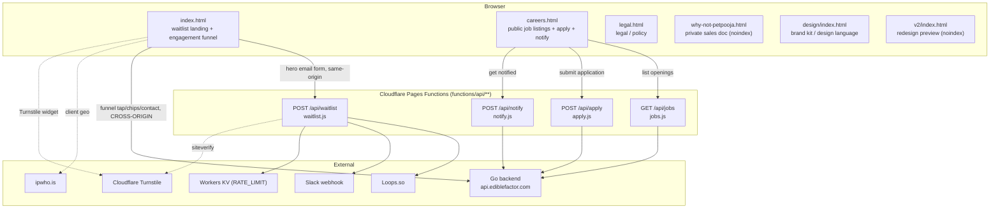
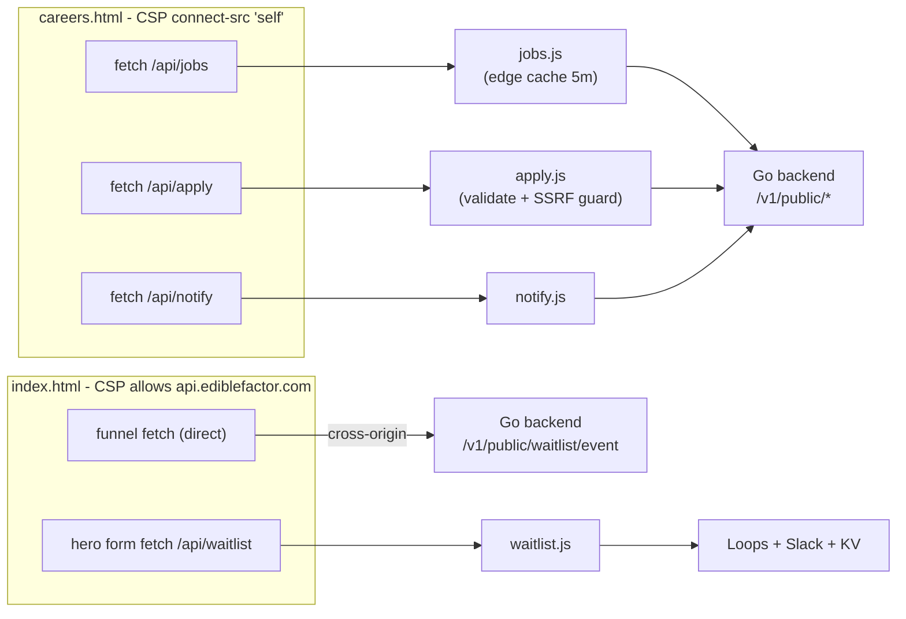
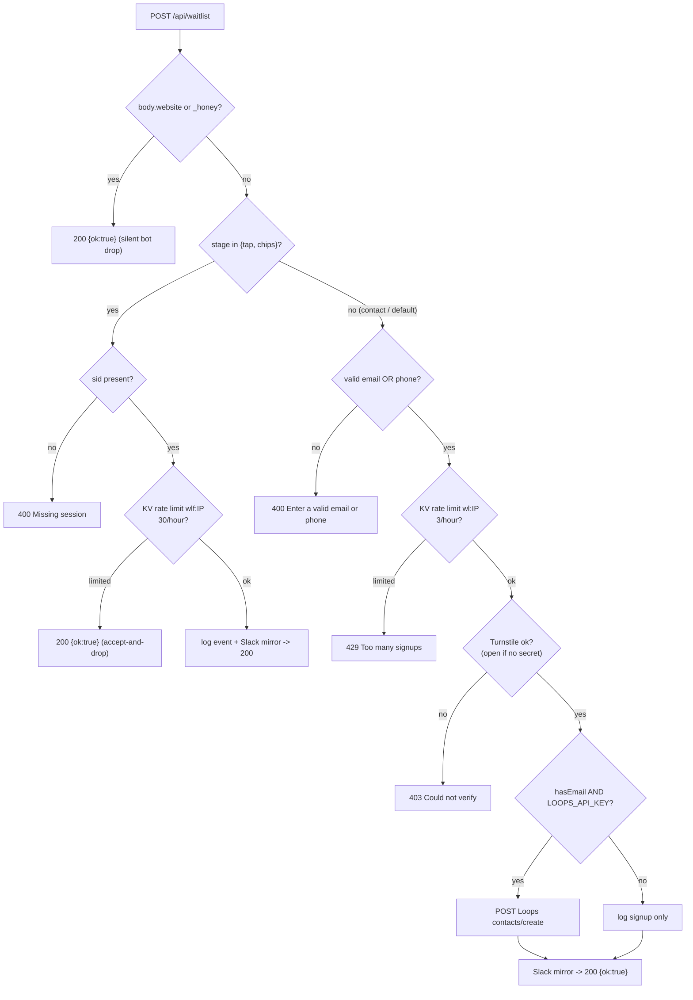
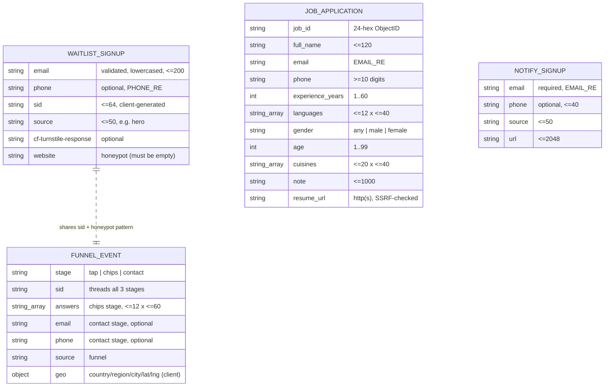
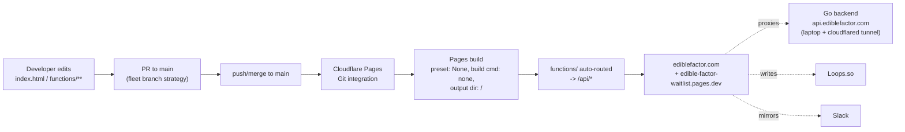

# Architecture - Edible Factor Waitlist (apex marketing site)

## What this is

This repo is the apex marketing + waitlist site served at `ediblefactor.com`, hosted on Cloudflare Pages (project `edible-factor-waitlist`, also reachable at `edible-factor-waitlist.pages.dev`). It is a set of hand-written, largely static HTML pages - each page inlines its own styles, scripts, and SVGs, with no framework, bundler, or build step (editing a page is editing one file). Dynamic behaviour comes from a handful of Cloudflare Pages Functions under `functions/api/**` that run on the Workers runtime (Web-standard `Request`/`Response`, no Node APIs). Two classes of dynamic surface exist: (1) the site's own signup storage - `POST /api/waitlist` writes signups to Loops.so and/or Slack directly from the Function, and (2) same-origin proxies (`/api/jobs`, `/api/apply`, `/api/notify`) that forward to the Go backend at `api.ediblefactor.com` so the page CSP can stay `connect-src 'self'`. One exception: the `index.html` progressive engagement funnel posts its `tap`/`chips`/`contact` events cross-origin, directly to the Go backend at `https://api.ediblefactor.com/v1/public/waitlist/event`.

### Tech stack (actual, from the files)

- **Hosting / runtime:** Cloudflare Pages + Pages Functions (Cloudflare Workers runtime). No `wrangler.toml` at the repo root - Pages auto-detects `functions/` and the build output directory `/`.
- **Frontend:** plain HTML5, vanilla JS (IIFEs, no dependencies), inlined CSS. `index.html` inlines a precompiled ~9KB Tailwind v3.4.10 utility subset (regenerated manually, `corePlugins.preflight:false`); there is no runtime Tailwind CDN.
- **Fonts:** Google Fonts CSS (`fonts.googleapis.com` / `fonts.gstatic.com`) - the only third-party asset.
- **Bot / abuse controls:** honeypot fields (`website` / `_honey`), Cloudflare Turnstile (`challenges.cloudflare.com`, dormant until a site key + `TURNSTILE_SECRET` are set), Workers KV rate limiting (`RATE_LIMIT` binding).
- **Signup sinks:** Loops.so (`app.loops.so/api/v1/contacts/create`), Slack incoming webhook, and (via the backend proxies) the Go API's public endpoints.
- **Client geo enrichment (funnel only):** `ipwho.is` (keyless HTTPS IP geolocation).
- **Optional tooling:** `tools/capture-mockups/` is a self-contained Playwright + Chromium Node project that screenshots the live app into `mockups/`; nothing at runtime depends on it.

There is no `package.json` at the repo root and no `go.mod` - this repo ships no compiled artifact. The only npm project is the mockup-capture tool.

## Page map



### Pages

| Path (served) | File | Purpose | Indexed? |
|---|---|---|---|
| `/` , `/index.html` | `index.html` | Waitlist landing: hero email form, card-deck walkthrough (phone mockups), animated counters, and the progressive engagement funnel. | Yes |
| `/careers` , `/careers.html` | `careers.html` | Public job listings (filters + share codes), anonymous job application form, and a "get notified" email capture. | Yes |
| `/legal` , `/legal.html` | `legal.html` | Legal / policy content. Static, `connect-src 'self'`, no forms. | Yes |
| `/why-not-petpooja(.html)` | `why-not-petpooja.html` | Private sales document. `noindex` via page `<meta>`, `_headers` `X-Robots-Tag`, and `robots.txt` Disallow. | No (blocked) |
| `/design` | `design/index.html` | Brand kit / design language page with SVG + PNG emblem downloads (`design/assets/`). | Yes |
| `/v2` | `v2/index.html` | Redesign preview ("not the live homepage" ribbon). Loads external `assets/styles.css`, `app.js`, `lenis.min.js`. `noindex`. | No |

Static assets at the root: `ef-mark.svg`, `ef-mark-180.png`, `favicon.ico`, `og-image.png`, `manifest.webmanifest`, `robots.txt`, and `mockups/*.webp` (deck screenshots: `home-dashboard`, `restaurants-browse`, `ai-sommelier`, `calorie-trend`).

### Pages Functions endpoints

| Endpoint | Method(s) | File | What it does |
|---|---|---|---|
| `/api/waitlist` | `POST`, `OPTIONS` | `functions/api/waitlist.js` | Site's own signup + engagement sink. Handles the classic email form and the funnel `stage` shapes (`tap` / `chips` / `contact`; missing stage defaults to `contact`). Honeypot short-circuit, KV rate limit, optional Turnstile siteverify, then writes email signups to Loops and mirrors to Slack. Does NOT proxy the Go backend. |
| `/api/jobs` | `GET` | `functions/api/jobs.js` | Same-origin proxy to `GET {BACKEND}/v1/public/jobs`. Normalizes `role` / `scouter_restaurant_id` / `outlet_id`, forces `page=1&per_page=100`, edge-caches OK responses in `caches.default` for 5 min to shield the laptop backend. |
| `/api/apply` | `POST`, `OPTIONS` | `functions/api/apply.js` | Same-origin proxy to `POST {BACKEND}/v1/public/jobs/{id}/applications`. Honeypot, validates `job_id` (24-hex ObjectID), name/email/phone; whitelists forwarded fields; SSRF-hygienes `resume_url` (rejects IP literals, `localhost`, `*.internal`, `169.254.169.254`). |
| `/api/notify` | `POST`, `OPTIONS` | `functions/api/notify.js` | Same-origin proxy to `POST {BACKEND}/v1/public/notify-signups`. Honeypot, requires valid email; forwards `email` + optional `phone`/`source`/`url`. Backend dedupes then batches Discord + Loops off the request path. |

All four Functions send `X-Platform: ediblefactor` and `X-Request-Time` (unix seconds) to the backend and never proxy arbitrary keys - each explicitly names the fields it forwards.

## The engagement funnel (key flow)

The funnel is a self-contained IIFE at the bottom of `index.html`. It threads a client-generated `sid` (localStorage `eff_sid_v1`) through three stages, caches progress in localStorage (`eff_state_v1`: `'' | dismissed | tapped | feedback_done | contact_done`) so a returning browser is never re-asked, and posts events **directly to the Go backend** (not through a Pages Function). The hero email form is a separate path and stays on same-origin `/api/waitlist`.

```mermaid
sequenceDiagram
  participant U as Visitor
  participant P as index.html funnel IIFE
  participant GEO as ipwho.is
  participant BE as api.ediblefactor.com<br/>/v1/public/waitlist/event
  participant WL as /api/waitlist (Pages Fn)
  participant L as Loops.so

  Note over P: on load, warm geo lookup (cached in sessionStorage)
  P->>GEO: GET https://ipwho.is/
  GEO-->>P: {country, region, city, lat, lng}

  U->>P: heart tap (inline or scroll popup at 45%)
  P->>BE: POST {stage:"tap", sid, source:"funnel", geo...}
  Note over P: state = tapped; open feedback modal

  U->>P: select feedback chips, submit
  P->>BE: POST {stage:"chips", sid, answers[]}
  Note over P: state = feedback_done; show contact panel

  U->>P: enter email OR phone, submit
  P->>BE: POST {stage:"contact", sid, email?, phone?}
  BE-->>P: {ok:true} or {error}
  Note over P: state = contact_done; show "Thank you"

  Note over U,L: Separate path - hero email form
  U->>WL: POST /api/waitlist {email, source:"hero", website(honeypot), cf-turnstile-response}
  WL->>L: POST contacts/create (if LOOPS_API_KEY set)
  WL-->>U: {ok:true} / 400 / 429 / 403
```

Funnel endpoint selection (from the IIFE): `localhost`/`127.0.0.1` -> `http://localhost:9090/v1/public/waitlist/event`, otherwise `https://api.ediblefactor.com/v1/public/waitlist/event`. Turnstile is wired but dormant (`EFF_TURNSTILE_SITE_KEY = ''`); `getToken()` resolves `''` so the funnel never blocks. Geo is best-effort enrichment only.

## Request flow: same-origin proxy vs direct backend



Why two patterns: `careers.html` pins `connect-src 'self'`, so it must reach the backend through same-origin Functions (which also sidesteps CORS and lets `/api/jobs` cache). `index.html` deliberately loosens `connect-src` to include the backend hosts so the funnel can post directly and the backend sees the real client IP via `CF-Connecting-IP`.

## `/api/waitlist` internal decision flow



## Modules / directories

| Path | Responsibility |
|---|---|
| `index.html` | Entire waitlist landing page: markup, inlined CSS (custom + preflight reset + Tailwind subset), and JS (reveal IO, counters, hero form, engagement funnel IIFE). |
| `careers.html` | Careers page: job-list rendering from `/api/jobs`, application form -> `/api/apply`, notify form -> `/api/notify`. |
| `legal.html`, `why-not-petpooja.html` | Static content pages (policy; private sales doc). |
| `design/` | Brand-kit page + emblem assets (`design/assets/ef-mark*.svg`). |
| `v2/` | Redesign preview; the only page with external `assets/` (`styles.css`, `app.js`, `lenis.min.js`). Noindex. |
| `functions/api/waitlist.js` | Signup + funnel-fallback Function; Loops/Slack/KV/Turnstile logic. |
| `functions/api/jobs.js` | Cached GET proxy for public job listings. |
| `functions/api/apply.js` | Validated POST proxy for job applications (SSRF-guarded resume URL). |
| `functions/api/notify.js` | POST proxy for generic "get notified" signups. |
| `_headers` | Cloudflare Pages per-path HTTP headers: security headers, cache policy, `X-Robots-Tag` on the private doc. |
| `mockups/` | `.webp` phone screenshots referenced by the `index.html` card deck. Immutable-cached per filename. |
| `tools/capture-mockups/` | Separate Playwright Node project that regenerates `mockups/`. Not part of the deployed site. |
| `docs/ARCHITECTURE.md` | Existing deploy/topology note (fleet-level). |
| `.wrangler/` | Local Wrangler state (gitignored). |

## Data shapes (payloads, not a database)

This repo owns no database - persistence lives in Loops, Slack, and the Go backend. The important shapes are the JSON payloads.



Key validators (defined in the Functions): `EMAIL_RE = /^[^\s@]+@[^\s@]+\.[^\s@]+$/`, `PHONE_RE = /^[+]?[\d\s()-]{7,20}$/`, `OBJECT_ID = /^[a-f0-9]{24}$/i`, genders `{any, male, female}`, roles `{chef, bartender, server, manager}`.

## Security posture

### CSP `connect-src` per page

| Page | `connect-src` hosts allowed |
|---|---|
| `index.html` | `'self'`, `https://challenges.cloudflare.com`, `https://api.ediblefactor.com`, `https://api-dev.ediblefactor.com`, `http://localhost:9090`, `https://ipwho.is` |
| `careers.html` | `'self'` only (all backend traffic goes through Pages Functions) |
| `design/index.html` | `'self'` only |
| `legal.html`, `why-not-petpooja.html` | no `connect-src` directive (default-src `'self'` applies; `why-not-petpooja` also drops `'unsafe-inline'` from `script-src`) |

Every page sets `frame-ancestors 'none'`, `base-uri 'self'`, `img-src 'self' data:`, and `font-src https://fonts.gstatic.com data:`. `index.html` additionally allows `script-src ... https://challenges.cloudflare.com` and `frame-src https://challenges.cloudflare.com` for Turnstile.

### `_headers` (Cloudflare Pages)

| Rule | Effect |
|---|---|
| `/*` | `X-Content-Type-Options: nosniff`, `X-Frame-Options: DENY`, `Referrer-Policy: strict-origin-when-cross-origin`, `Permissions-Policy: camera=(), microphone=(), geolocation=()` |
| `/mockups/*`, `/*.webp` | `Cache-Control: public, max-age=31536000, immutable` (replace by new filename, not overwrite) |
| `/`, `/index.html`, `/careers`, `/careers.html` | `Cache-Control: public, max-age=300, must-revalidate` |
| `/why-not-petpooja`, `/why-not-petpooja.html` | `X-Robots-Tag: noindex, nofollow, noarchive, nosnippet` |

### CORS on `/api/waitlist`

`ALLOWED_ORIGIN` regex admits only `(*.)(edible-factor-waitlist|ediblefactor-waitlist).pages.dev` and `(www.)ediblefactor.(com|app|in)`. Tightened off an earlier `*.pages.dev` wildcard (waitlist#7) so arbitrary Pages projects cannot call it. The proxy Functions (`jobs`/`apply`/`notify`) are same-origin only and do not emit CORS allow-origin headers.

### Abuse controls (defense in depth)

- **Honeypot** (`website` / `_honey`): present on all four Functions; a filled field returns `200 {ok:true}` and silently drops.
- **KV rate limit** (`RATE_LIMIT` binding): `/api/waitlist` uses `wl:IP` = 3/hour (strict, contact) and `wlf:IP` = 30/hour (lenient, tap/chips). Degrades to no-op if the KV namespace is unbound.
- **Turnstile:** `/api/waitlist` verifies server-side via `challenges.cloudflare.com/turnstile/v0/siteverify` only when `TURNSTILE_SECRET` is set; otherwise it degrades open (honeypot still guards). Client widgets are dormant until a site key is provisioned.

## Environment variables and secrets

Set in the Cloudflare Pages project settings (Workers runtime `env` arg; not `process.env`). All are optional - each Function degrades gracefully when unset.

| Variable | Used by | Effect if unset |
|---|---|---|
| `LOOPS_API_KEY` | `waitlist.js` | Email signups are log-only (visible via `wrangler tail` / dashboard). |
| `SLACK_WEBHOOK_URL` | `waitlist.js` | No Slack mirror; user response unaffected (fire-and-forget). |
| `RATE_LIMIT` (KV binding) | `waitlist.js` | Rate limiting is a no-op; signups never break. |
| `TURNSTILE_SECRET` | `waitlist.js` | Turnstile check skipped (degrades open); honeypot still guards. |
| `BACKEND_API_URL` | `jobs.js`, `apply.js`, `notify.js` | Falls back to `https://api.ediblefactor.com`. |

Commented-but-not-wired alternates in `waitlist.js`: Resend (`RESEND_AUDIENCE_ID`) and a Google Sheets webhook (`SHEETS_WEBHOOK_URL`). Local secrets go in `.dev.vars` / `.env*` (gitignored).

## Deploy topology



| Aspect | Value |
|---|---|
| Host | Cloudflare Pages, project `edible-factor-waitlist` |
| Domains | `ediblefactor.com` (apex), `edible-factor-waitlist.pages.dev` |
| Deploy trigger | Push/merge to `main` -> Pages Git integration builds and deploys automatically |
| Build preset | None; build command blank; output directory `/` |
| Functions | `functions/api/*.js` auto-detected and routed to `/api/*` |
| Manual deploy | `npx wrangler pages deploy . --project-name ediblefactor-waitlist` |
| Local dev | `npx wrangler pages dev .` (-> `:8788`, includes Functions) or `python3 -m http.server` (static only) |

Do NOT add a GitHub Actions deploy workflow - it would race the dashboard Git integration (a prior attempt was reverted fleet-wide). Backend availability depends on Abhi's laptop + the `cloudflared` tunnel being up; a 502/521 from `api.ediblefactor.com` usually means the laptop is asleep, and it will surface as a 502 from `/api/jobs`/`/api/apply`/`/api/notify`.

## How to review a change

| Change type | Where it lands | What a reviewer checks |
|---|---|---|
| Copy / layout / new section | The relevant `*.html` (`index.html`, `careers.html`, ...) | If a below-the-fold block is added to `index.html`, it must carry the `reveal` class or it appears without the fade and breaks page rhythm. |
| New Tailwind utility class in markup | `index.html` `<style>` "Static utility set" block | The utility subset is a manual compile step (Tailwind v3.4.10, preflight off). A new class silently no-ops until the subset is regenerated - confirm it was. |
| Card-deck / animation | `index.html` markup (`data-pos`, `deck__card`) + CSS keyframes + JS | The choreography is tightly coupled - JS `data-pos` rotation and the CSS `.is-flipping`/`.is-rising` keyframes must change together, or the deck desyncs. |
| New / changed mockup | `mockups/*.webp` + `` in `index.html` | Cache is `immutable` per filename - a replacement must use a NEW filename, not overwrite, or visitors keep the year-cached old image. |
| Hero email form | `index.html` submit handler + `functions/api/waitlist.js` | Endpoint must stay relative (`/api/waitlist`); do not reintroduce an absolute URL (that was the Vercel-origin bug). Envelope is `{ok:true}` / `{error}` with 400/429/403/500. |
| Engagement funnel | `index.html` funnel IIFE | Funnel posts direct to `api.ediblefactor.com`; if a new host is added, update `index.html`'s CSP `connect-src`. Keep `sid` threading and localStorage state machine intact; keep Turnstile/geo best-effort (never blocking). |
| Careers list/apply/notify | `careers.html` + `functions/api/{jobs,apply,notify}.js` | `careers.html` CSP is `connect-src 'self'` - all backend calls MUST go through a Pages Function, never a direct cross-origin fetch. Functions must whitelist forwarded fields (never proxy arbitrary keys) and keep the honeypot check first. |
| A new Pages Function | `functions/api/<name>.js` | Workers runtime only: Web `Request`/`Response`, read `env` (not `process.env`), no `Buffer`/`fs`/Node APIs. Read client IP via `cf-connecting-ip`. Add honeypot + validation; forward `X-Platform` + `X-Request-Time` if proxying the backend. |
| New env var / secret | Cloudflare Pages dashboard + the Function that reads it | Confirm the graceful-degradation path (unset -> log-only / no-op / open) so an unbound secret never breaks the form. Document it here and in `README.md`. |
| Cache / security header | `_headers` | Per-path ordering matters; `immutable` only for versioned assets; keep the private-doc `X-Robots-Tag` triple-guard (page meta + header + `robots.txt`). |
| No en/em dashes | any file | Fleet forbids U+2013 / U+2014; use `-` or ` - `. |
| Process | GitHub project board first | Fleet ticket-first workflow: create the board item, then branch off `main` (`feature/`, `bug/`, `enhancement/`, `chore/`), PR back, no self-merge. |

## Notes / could-not-verify

- No `wrangler.toml` exists in the repo; Pages config (build preset "None", output `/`, and all env/KV bindings) lives in the Cloudflare dashboard, which I cannot read from the repo. The build settings listed come from `README.md` and `docs/ARCHITECTURE.md`, not a committed config file.
- `docs/ARCHITECTURE.md` lists `npm run dev` / `npm run build` in a "Build / preview" table, but there is no root `package.json` and both `README.md`/`CLAUDE.md` state there is no build step. Those two rows appear stale/generic; the real local commands are `wrangler pages dev .` or a static server. Worth a human correction to that existing doc.
- The Go backend endpoints (`/v1/public/jobs`, `/v1/public/jobs/{id}/applications`, `/v1/public/notify-signups`, `/v1/public/waitlist/event`) are named by the client/Functions in this repo; their request/response schemas are owned by `edible-factor-backend` and were not read here.
- `v2/` and `design/` are secondary pages I inspected only at the head/asset level (their inline JS was not fully read); treated as preview/brand-kit surfaces per their own banners and `noindex`.
- Exact Turnstile site keys and whether `TURNSTILE_SECRET`/`LOOPS_API_KEY`/`SLACK_WEBHOOK_URL`/`RATE_LIMIT` are currently bound in production cannot be determined from the repo (dashboard-only). Code paths show the site is written to run correctly whether or not they are set.